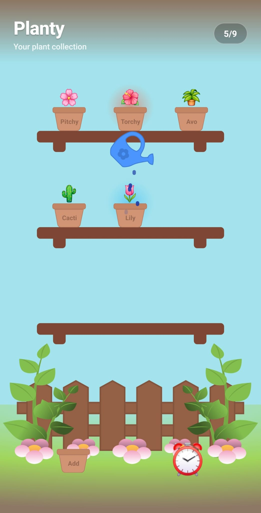
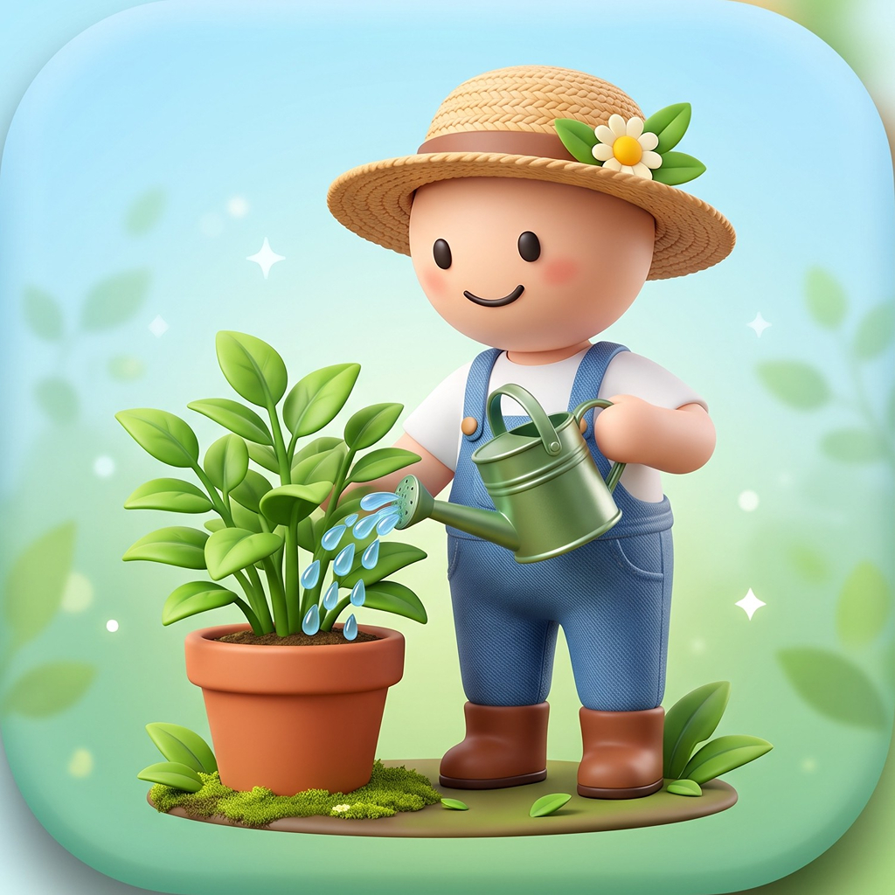

<div align="center">
  <h1 style="color: #68A64D;">🌿 Planty 🌿</h1>
  <p style="color: #A1D65C; font-size: 1.2em; font-weight: bold;">
    Your personal offline-first digital garden
  </p>
</div>

<br/>

<div align="center">
  
</div>

<br />

Planty is a cross-platform mobile application built with React Native and TypeScript that helps users track and manage their indoor plant care. It acts as a digital garden where you can add plants, track watering schedules, and receive timely notifications to keep your plants healthy.

<hr style="border: 1px solid #A1D65C;"/>

## ✨ Features

- 💧 <span style="color: #68A64D; font-weight: bold;">Interactive Watering:</span> Drag and drop a virtual sprinkler over your plants to water them, featuring real-time water drop animations using React Native's `PanResponder` and `Animated` APIs.
- 📴 <span style="color: #68A64D; font-weight: bold;">Offline-First:</span> Built entirely offline. All data is persisted securely on your device using `@op-engineering/op-sqlite`, ensuring the app works perfectly without an internet connection.
- 🔔 <span style="color: #68A64D; font-weight: bold;">Smart Reminders:</span> Automatically schedules local push notifications using `@notifee/react-native` to remind you exactly when each plant needs watering. You can customize the time of day you want to receive these reminders.
- 🎨 <span style="color: #68A64D; font-weight: bold;">Custom Vector Graphics:</span> A visually engaging interface featuring custom SVGs and beautiful gradients (`react-native-svg` & `react-native-linear-gradient`) instead of standard UI components.

<hr style="border: 1px solid #A1D65C;"/>

## 🛠 Tech Stack

| Technology | Purpose |
|------------|---------|
| **React Native** | Cross-platform mobile framework |
| **TypeScript** | Type-safe development |
| **`@op-engineering/op-sqlite`** | Fast, local offline database |
| **`@notifee/react-native`** | Reliable local push notifications |
| **`react-native-svg`** | Scalable vector graphics |

<hr style="border: 1px solid #A1D65C;"/>

## 🚀 Getting Started

### Prerequisites
- **Node.js** (>= 22.11.0)
- **React Native CLI** environment setup (Android Studio / Xcode)

### Installation

1. Clone the repository and navigate to the frontend directory:
   ```bash
   cd frontend
   ```

2. Install dependencies:
   ```bash
   npm install
   ```

3. Install iOS Pods (macOS only):
   ```bash
   cd ios && pod install && cd ..
   ```

### Running the App

Start the Metro Bundler:
```bash
npm start
```

**Run on Android:**
```bash
npm run android
```

**Run on iOS:**
```bash
npm run ios
```

<br/>
<div align="center">
  <p style="color: #68A64D;">
    <b>Built with 💚 for plant lovers.</b>
  </p>
  
</div>
